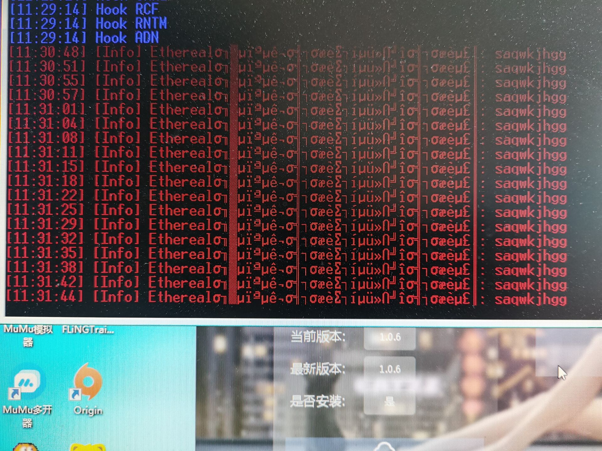

# 空灵注入时闪退崩溃


**请各位空灵用户发现注崩问题及时联系我，补充到此教程**

**防止后来使用的用户出现不必要的烦恼**


## **序列**1：

**请卸载或关闭安装的某杀软管家丨某60丨某大师**

**关闭系统自带的安全中心防火墙+杀毒设置，进入游戏内故事模式，再右键管理员运行Eth注入器**

**关闭教程请跳转到此【**[**注入失败或游戏闪退**](https://ruohandocs-1.gitbook.io/ruo-han-jiao-cheng-wiki/solve)**】**

****

## **序列2：**


**请在C盘找到ETH文件，下载官方群或者售后群此文件**

****.png>)****

**解压缩后替换到c盘ETH文件内即可**


****

## **序列3：**

GCA92\~UA8Q%K9IIBJPY.jpg)


**关加速器，卸载重装**

